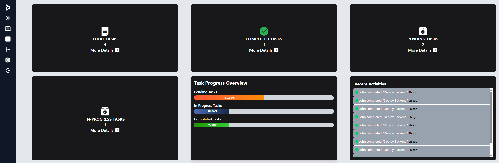
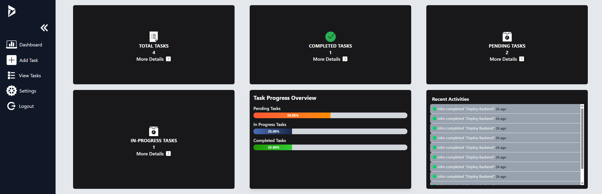
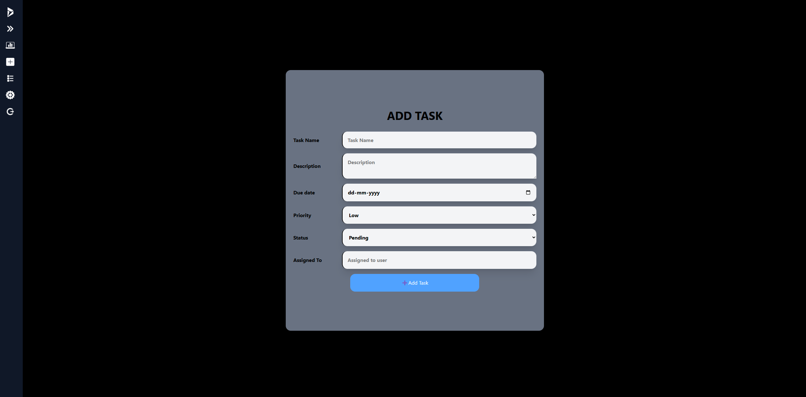
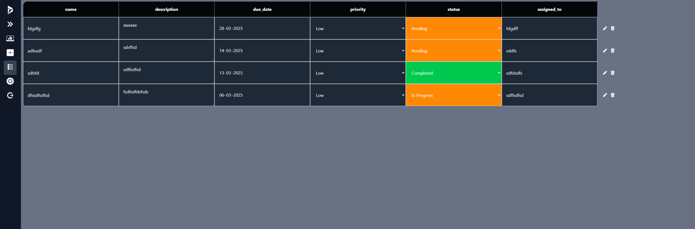
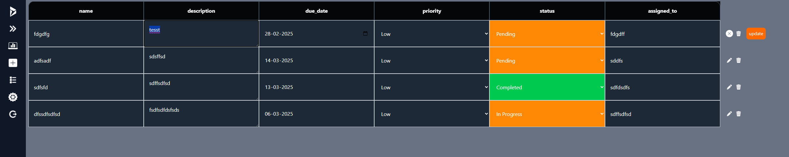

# Task Manager App

## Tech Stack
- **Frontend:** React + Redux  
- **Backend:** Python FastAPI → [GitHub Repo](https://github.com/remeshkrishna/task-manager-backend)

---

## Authentication
### Login & Signup Pages
- JWT-based authentication

---

## Dashboard
- **Overview Cards:** Pending, In Progress, Completed tasks  
- **Recent Activities:** Scrollable list of recent actions  
- **Task Progress:** Category-wise progress bars  
- **Quick Actions:** Add Task, View All Tasks buttons  
- **Task List (Compact View):** Search, filter, sort tasks  
- **Calendar View :** Upcoming task deadlines  

---

## Task Management
### Add Task Page
- Form for task creation  

### All Tasks Page
- View, edit, delete tasks  

### Task Details Page
- Full details with comments & activity log  

### Backend
- FastAPI + PostgreSQL  

---

## User Authentication
- User registration & login  
- Secure password hashing  
- JWT authentication  

---

## Task Management
- **CRUD Operations:** Create, Read, Update, Delete tasks  
- **Task Details:** Title, description, status, priority, due date  
- **Timestamps:** Track task creation & modification  
- **Task Assignments:** Store user-task associations  

---

## Activity Logging
- Log task changes (status updates, comments)  
- Fetch recent activities for the dashboard  

---

## Database (PostgreSQL)
- Tables for Users, Tasks, and Activities  
- Efficient indexing for performance  

---

## API Endpoints
- `/signup` → Register user  
- `/token` → Authenticate user  
- `/tasks` → CRUD operations  
- `/users` → User operations  
- **Middleware:** CORS & security  
